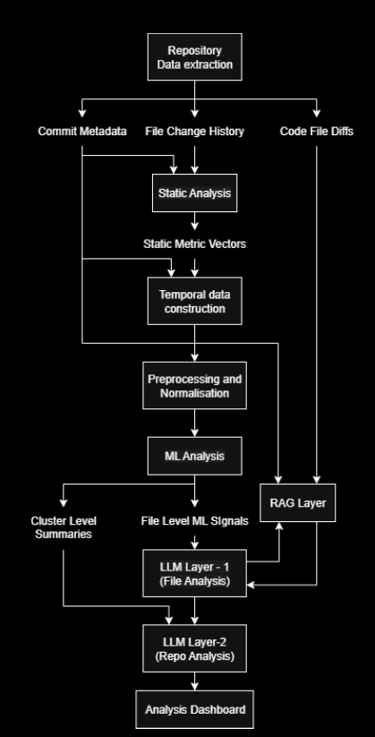
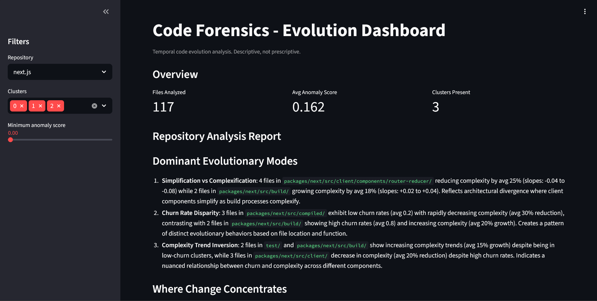
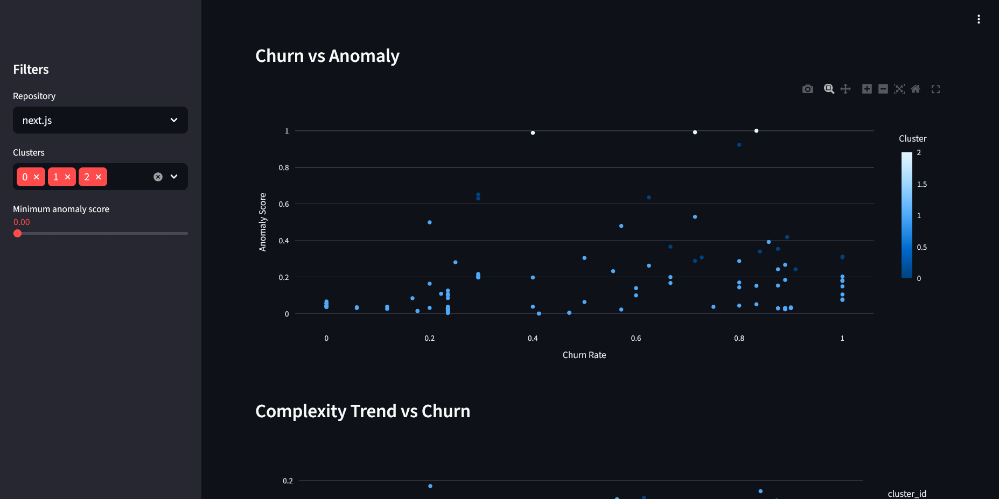
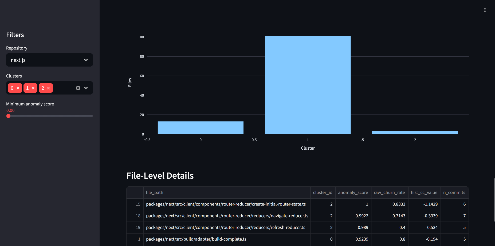

# Code Forensics

## Objective

An **empirical study** evaluating whether combining **static code metrics**, **classical machine learning**, and **LLM-based semantic reasoning** provides better code quality analysis than using each technique independently.

The pipeline ends in an interactive **Streamlit dashboard** that visualises per-file anomaly scores, cluster membership, churn rates, and the LLM-generated repository synthesis report.

---
## System Architecture


---

## Repository Structure

```
code-forensics/
├── scripts/
│   ├── extract_git_data.py           # Git history extraction (commits, diffs)
│   ├── run_static_analysis.py        # Static analysis runner (Python + JS/TS)
│   ├── static_python.py              # Python metrics via radon
│   ├── static_js.py                  # JS/TS metrics via Babel AST
│   ├── analyze_js_ast.js             # Node.js Babel AST analyzer
│   ├── ml_pipeline.py                # ML layer (clustering, anomaly detection)
│   ├── faiss_rag.py                  # FAISS diff-embedding indexer
│   ├── llm_pipeline_rag.py           # LLM pipeline with RAG (FAISS-grounded)
│   ├── llm_pipeline_llm_only.py      # LLM-only pipeline (no RAG, for comparison)
│   ├── generate_commit_snapshots.py  # Commit-level snapshot generator
│   ├── generate_required_outputs.py  # Generates required evaluation outputs
│   ├── generate_evaluation_artifacts.py # Evaluation plots and artefacts
│   ├── analyze_output.py             # Output analysis helpers
│   ├── app.py                        # Streamlit dashboard
│   ├── extract_python_metrics.py     # Legacy (superseded by static_python.py)
│   ├── package.json                  # Node.js dependencies
│   └── package-lock.json
├── data/
│   ├── commits.csv                   # Commit metadata
│   ├── file_changes.csv              # Files changed per commit
│   ├── diffs.csv                     # Code diffs
│   ├── metrics_all.csv               # Static analysis metrics
│   ├── file_analysis.json            # ML per-file outputs
│   ├── cluster_summary.json          # ML cluster summaries
│   ├── faiss.index                   # FAISS index (diff embeddings)
│   └── faiss_documents.pkl           # FAISS document store
├── output/
│   ├── file_explanations.json        # LLM file-level explanations
│   ├── repository_report.md          # LLM repo synthesis (markdown)
│   ├── repository_report.json        # LLM repo synthesis (structured JSON)
│   ├── grounding_metrics.json        # LLM grounding/compliance metrics
│   └── checkpoint.json               # Intermediate LLM checkpoint
├── repos/
│   └── <cloned_repos>/               # Target repositories
└── cf-env/                           # Python virtual environment
```
---
## Publication

Accepted and presented at **IEEE CONECCT 2026**.

- [IEEE Xplore Publication](...)
- [Presentation Certificate](/presentation_certificate.pdf)
- [Preprint PDF](...)
---

## Setup

### 1. Python Environment

```powershell
# Create and activate a virtual environment
python -m venv cf-env
.\cf-env\Scripts\Activate.ps1        # PowerShell

# Install dependencies
pip install -r requirements.txt
```

> **Note:** `requirements.txt` covers the core packages. The following are also required and should be installed manually if not already present:
> ```powershell
> pip install streamlit plotly scikit-learn sentence-transformers groq
> ```

### 2. Node.js Dependencies (for JS/TS analysis)

```powershell
cd scripts
npm install
```

### 3. Environment Variables

Create a `.env` file in the project root:

```
GROQ_API_KEY=your_groq_api_key_here
```

### 4. Clone Target Repositories

```powershell
cd repos
git clone <repo_url>
```

---

## Pipeline

Run the steps in order. Each step produces output consumed by the next.

### Step 1 — Extract Git Data

```powershell
python scripts/extract_git_data.py
```

- Set `REPO_NAME` inside the script to match your cloned repo folder name
- Extracts commits, file changes, and diffs into `data/`

### Step 2 — Run Static Analysis

```powershell
python scripts/run_static_analysis.py
```

- Analyses Python files with `radon` (LOC, cyclomatic complexity, maintainability index)
- Analyses JS/TS files with Babel AST (LOC, complexity, functions, imports)
- Outputs `data/metrics_all.csv`

### Step 3 — Run ML Pipeline

```powershell
python scripts/ml_pipeline.py --repo <repo_name>
```

- Builds per-file time series, KMeans clustering, and Isolation Forest anomaly scores
- Filters to files that exist at repository HEAD
- Outputs `data/file_analysis.json` and `data/cluster_summary.json`

### Step 4 — Build FAISS Diff Index

```powershell
python scripts/faiss_rag.py
```

- Embeds diffs from `data/diffs.csv` using `sentence-transformers`
- Outputs `data/faiss.index` and `data/faiss_documents.pkl`

### Step 5 — Run LLM Interpretation (RAG pipeline)

```powershell
python scripts/llm_pipeline_rag.py
```

- Requires `GROQ_API_KEY`
- Uses FAISS to ground LLM explanations in actual diffs
- Produces `output/file_explanations.json`, `output/repository_report.json`, and `output/repository_report.md`

> **LLM-only baseline** (no RAG, for comparison):
> ```powershell
> python scripts/llm_pipeline_llm_only.py
> ```

### Step 6 — Generate Evaluation Artefacts (optional)

```powershell
python scripts/generate_evaluation_artifacts.py
```

- Produces comparison plots and evaluation tables for the empirical study

---

## Streamlit Dashboard

The dashboard visualises all pipeline outputs in one place.

### Launch

```powershell
# From the project root, with the virtual environment active:
streamlit run scripts/app.py
```

Then open [http://localhost:8501](http://localhost:8501) in your browser.







### Dashboard Sections

| Section | Description |
|---------|-------------|
| **Overview metrics** | Total files analysed, average anomaly score, cluster count |
| **Repository Analysis Report** | Full LLM-generated synthesis with grounding metrics |
| **Churn vs Anomaly** | Scatter plot of churn rate against anomaly score, coloured by cluster |
| **Complexity Trend vs Churn** | Cyclomatic complexity slope vs churn rate per file |
| **Cluster Distribution** | Bar chart of file counts per cluster |
| **File-Level Details** | Sortable table of all files with anomaly score, churn, complexity, and commit count |

### Sidebar Filters

- **Repository** — switch between analysed repos
- **Clusters** — include/exclude specific clusters
- **Minimum anomaly score** — filter to files above a threshold

> The dashboard requires `data/file_analysis.json`, `data/cluster_summary.json`, and `output/repository_report.json` to be present (i.e., Steps 3 and 5 must have been run).

---

## Data Outputs

| File | Description |
|------|-------------|
| `commits.csv` | Commit hash, author, date, message |
| `file_changes.csv` | repo_name, commit_hash, file_path, change_type |
| `diffs.csv` | Code diffs for source files |
| `metrics_all.csv` | Static metrics: LOC, cyclomatic complexity, function count, imports |
| `file_analysis.json` | ML per-file features, cluster labels, anomaly scores |
| `cluster_summary.json` | ML cluster summaries |
| `faiss.index` | FAISS vector index over diffs |
| `faiss_documents.pkl` | FAISS document/metadata store |
| `file_explanations.json` | LLM file-level explanations |
| `repository_report.md` | LLM repo-level synthesis (markdown) |
| `repository_report.json` | LLM repo-level synthesis (structured JSON with grounding metrics) |
| `grounding_metrics.json` | LLM compliance/grounding metrics |

---

## Static Analysis Metrics

| Metric | Python | JS/TS |
|--------|--------|-------|
| LOC | Lines of code (radon) | Lines of code (Babel AST) |
| CC | Cyclomatic complexity (radon) | Decision points (AST) |
| MI | Maintainability index (radon) | N/A |
| Functions | Function count | Functions, methods, arrow functions |
| Imports | Import statements | ES6 imports + `require()` calls |

---

## Notes

- `MAX_COMMITS` (default 500) controls how far back extraction goes from HEAD
- Merge commits are skipped (`len(commit.parents) != 1`)
- Diffs are capped at `MAX_DIFF_CHARS` characters to keep rows compact
- Only files with extensions `.py`, `.js`, `.ts`, `.tsx`, `.jsx` are processed
- File identity is tracked by `file_path`; renames appear as a delete + add pair
- For large repos (e.g., Next.js ~6k files), static analysis can take 1–2 hours
